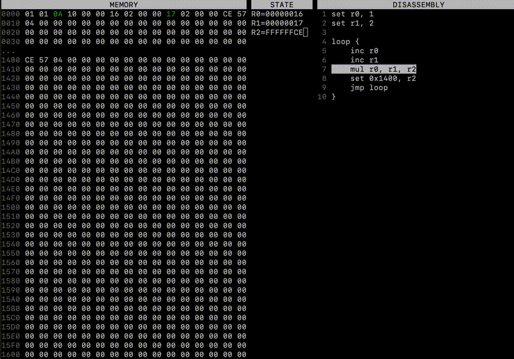

# Stark
Stark is a made-up CPU implementation created for hobby purposes.



### Contents
* cpu - emulator that simulates the behaviour of the CPU.
* sasmc - compiler for low-level, assembly-like language targeting Stark processors.

To learn about how the emulator or compiler works, check out READMEs in their directories.

### Getting started
To build any of the apps, you can `cd` to that application's directory and use `cmake` to build it.
Most applications do not have any third-party dependencies, so you should be good to go immediately.

For example, to build the emulator, you can just run these commands:
```
cd cpu
mkdir build
cmake -GNinja ..
ninja
```

After those are done, you should be able to run the emulator like this:
```
./emulator <input file>
```